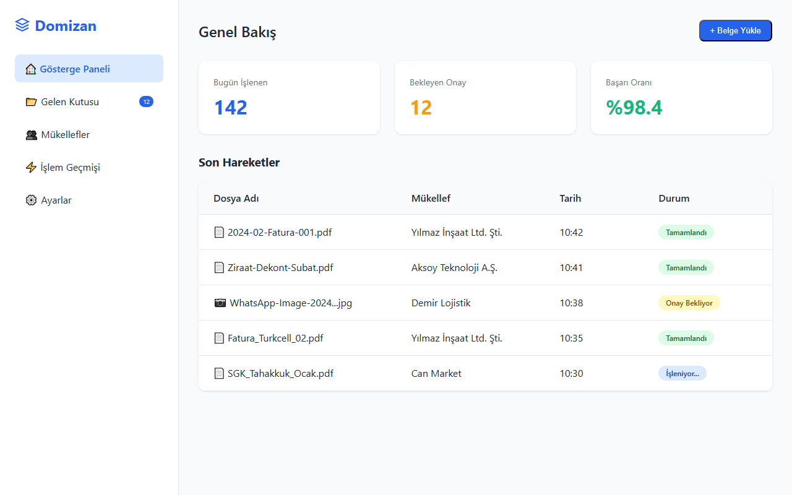

# Domizan v3: Mali Müşavirler İçin Geleceğin AI Asistanı

---

## 1. Problem: Verimsizlik ve Kaos

Mali müşavir ofislerinin günlük operasyonlarında yaşadığı temel sorunlar:

*   **Manuel Veri Girişi:** Günde yüzlerce belgenin elle sınıflandırılması ve işlenmesi.
*   **Hatalı Dosyalama:** Yanlış klasörlere giden belgelerin kaybolması ve zaman kaybı.
*   **İletişim Kopukluğu:** Mükelleflerle WhatsApp, e-posta ve telefon trafiğinde kaybolan bilgiler.
*   **Standart Yoksunluğu:** Her ofisin ve çalışanın farklı bir düzeni olması.

> "Bir mali müşavirin zamanının %60'ı, uzmanlık gerektirmeyen angarya işlere harcanıyor."

---

## 2. Çözüm: Domizan v3

Domizan v3, ofisinizin **akıllı iş ortağıdır**. En karmaşık süreçleri bile basit bir akışa indirger.

### Temel Yetenekler
1.  **Tam Otomasyon:** Gelen kutusunu izler, belgeleri tanır.
2.  **Yapay Zeka (AI):** İçeriği okur, VKN/TC'den mükellefi tespit eder.
3.  **Akıllı Yönlendirme:** Dosyayı doğru müşterinin doğru klasörüne taşır.
4.  **Sürekli Öğrenme:** Sizin düzeltmelerinizden öğrenir.

> *Yukarıda: Yapay zeka tarafından analiz edilen bir belgenin onay ekranı.*

---

## 3. Lisans ve Aktivasyon Akışı

Kullanıcı deneyimini engelleyen tüm bariyerleri kaldırdık. **Kurulum yok, bekleme yok.**

1.  **Hızlı Başlangıç (Free Tier):** İndir ve anında kullanmaya başla. Kredi kartı gerekmez.
2.  **Otomatik Lisanslama:** İlk kurulumda cihazınıza özel dijital bir kimlik (License Key) oluşturulur.
3.  **Kesintisiz Geçiş:** Deneme süresi bittiğinde, veri kaybı yaşamadan Premium aboneliğe geçiş yapılır.

> "Aktivasyon süresi: 30 saniyenin altında."

---

## 4. Teknoloji: Federatif Öğrenme (Federated Learning)

Domizan'ı rakiplerinden ayıran en büyük güç, **Kolektif Zeka**dır.

Bir ofiste yapılan düzeltme, (kvkk uyumlu şekilde) anonimleştirilerek sisteme öğretilir. Böylece bir kullanıcının deneyimi, tüm sistemi daha akıllı hale getirir.

*   **Gizlilik Odaklı:** Müşteri verileri asla paylaşılmaz, sadece "örüntüler" (pattern) öğrenilir.
*   **Veri Güvenliği:** Tüm işlemler yerel cihazda gerçekleşir, buluta sadece anonim öğrenme verisi gider.

---

## 5. İş Modeli: Basit Abonelik

Karmaşık hesaplamalar yok, sürpriz faturalar yok.

*   **Aylık/Yıllık Abonelik:** Tüm özelliklere sınırsız erişim sağlayan tek tip üyelik.
*   **Ücretsiz Deneme (Freemium):** Her kullanıcının sistemin gücünü risk almadan görmesi için cömert bir başlangıç paketi.
*   **Kurumsal Plan:** Çok şubeli ofisler için merkezi yönetim ve toplu lisanslama.

**Neden Abonelik?**
*   Ofislerin bütçe planlamasına uygun.
*   Sürekli güncellenen mevzuat ve yapay zeka modelleri.

---

## 6. Yol Haritası (Roadmap)

Geleceği bugünden planlıyoruz.

*   **Faz 1 (Backend):** Güçlü altyapı ve AI entegrasyonu (Tamamlandı).
*   **Faz 2 (Desktop):** Ofis içi tam entegrasyon ve otomasyon (BETA).
*   **Faz 3 (Mobil):** Telegram ve mobil erişim.
*   **Faz 4 (Zeka):** Federatif Öğrenme ağının aktifleşmesi.
*   **Faz 5 (Ekosistem):** Muhasebe programları ile doğrudan entegrasyon.

---

### Bize Katılın

Geleceğin muhasebe ofislerini birlikte inşa edelim.

**Domizan Yazılım**
